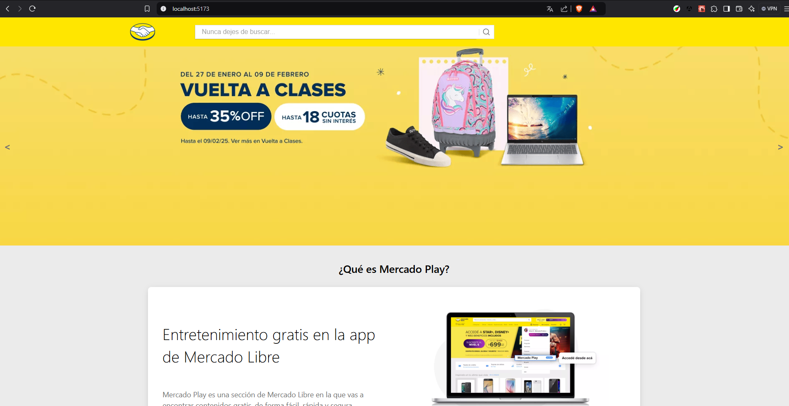
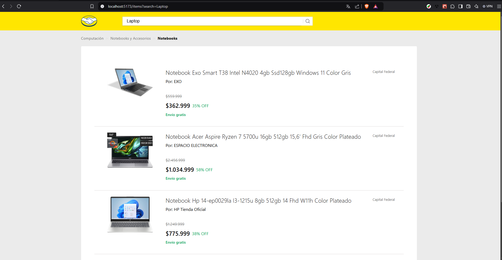
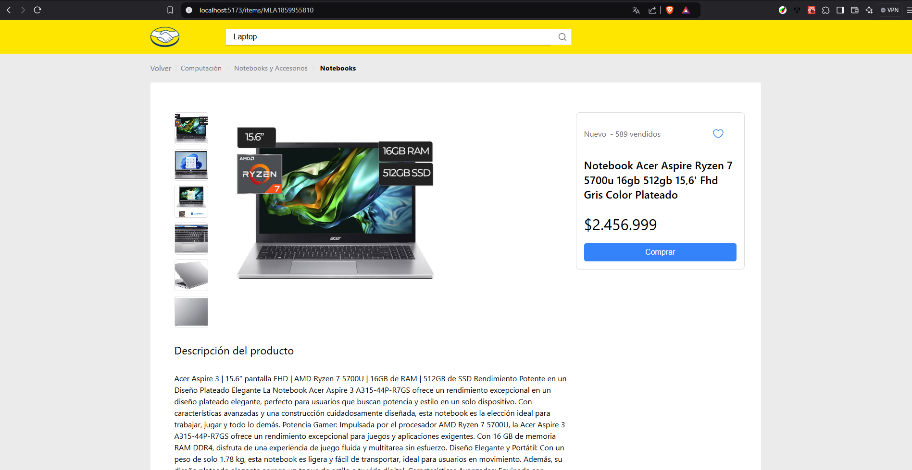
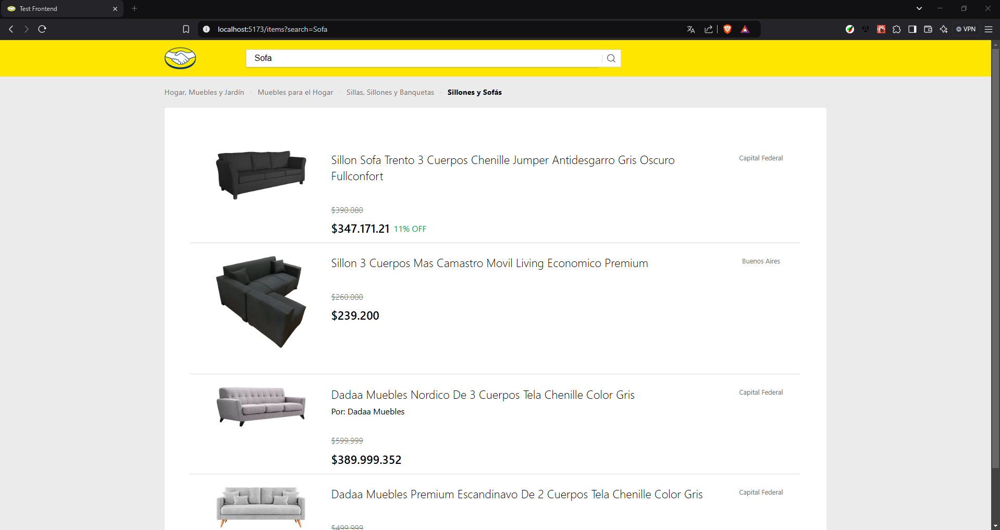
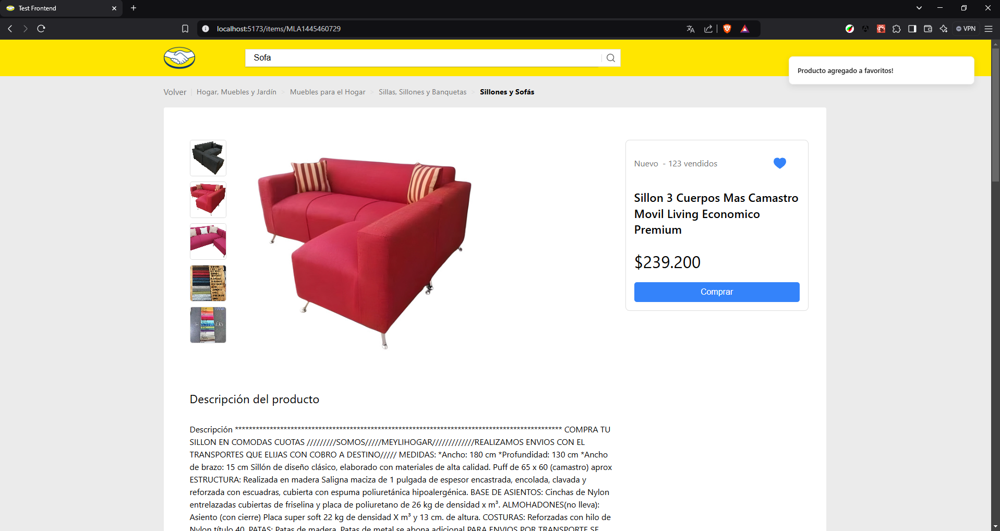
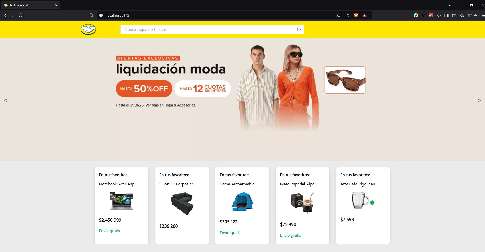
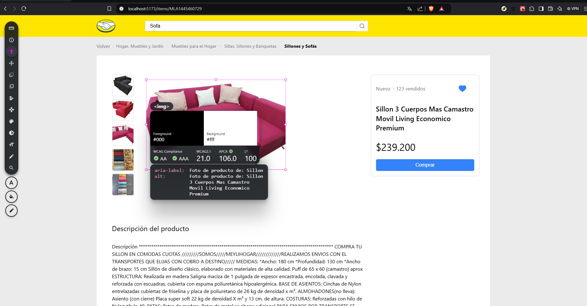

# Challenge Frontend Developer

Este desarrollo pertenece al test práctico para aspirantes al área de front-end de Mercado Libre. 

## Descripción:

La aplicación a desarrollar consta de tres componentes principales: la caja de búsqueda, la visualización de 
resultados, y la descripción del detalle del producto. Se solicito el desarrollo del Cliente y el Servidor para el requerimiento. 

#### Criterio de aceptación base:

1. **Búsqueda de productos:**
   * En la vista de caja de búsqueda, el usuario debe poder ingresar el nombre o parte del nombre del producto que desea buscar.
   * Al enviar el formulario, el sistema debe redirigir al usuario a la vista de "Resultados de búsqueda".
   * En la vista de "Resultados de búsqueda", se deben mostrar únicamente los primeros 4 productos que coincidan con la búsqueda.
   * Al hacer clic en uno de los productos de los resultados, el sistema debe redirigir al usuario a la vista de "Detalle de producto" correspondiente.

2. **Acceso directo a detalle de producto:**
   * El sistema debe permitir al usuario ingresar directamente a la vista de "Detalle de producto" proporcionando el ID del producto.
   * Al ingresar un ID de producto válido, el sistema debe mostrar la información detallada del producto correspondiente.

**Criterios a considerar:**
* Usabilidad
* SEO
* Performance
* Escalabilidad

#### Entregable:

 Repositorio en Github.

## Instalación

### Para instalar dependencias del servidor

```bash
cd/server
npm install
npm run dev

```
#### Variables de entorno:

Se debe crear un archivo .env y definir las siguientes variables:

```bash
PORT=3002

SEARCH_ITEM_API=https://api.mercadolibre.com/sites/MLA

VIEW_ITEM_API=https://api.mercadolibre.com/items

VIEW_ITEM_CATEGORIES_API=https://api.mercadolibre.com/categories

```

### Para instalar dependencias del cliente

```bash
cd/client
npm install
npm run dev

```

#### Variables de entorno:

Se debe crear un archivo .env y definir las siguientes variables:

```bash
VITE_BASE_URL=http://localhost:3002/api/items

```

## Stack del Proyecto:

#### server:
Node
Express
Nodemon
Axios
Typescript

#### client:
Node
Axios
Typescript
React
Vite
Sass
Sonner
Tanstack Query
React Router Dom
Context API

## Algunas capturas de pantalla del clujo:













## Accesobilidad revisada:

+AA +AAA



## Autor

[Francisco Molina](https://www.linkedin.com/in/franciscomolina-dev)